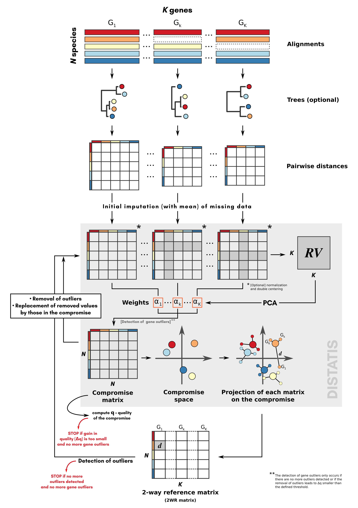
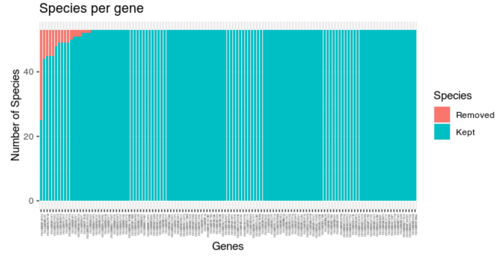
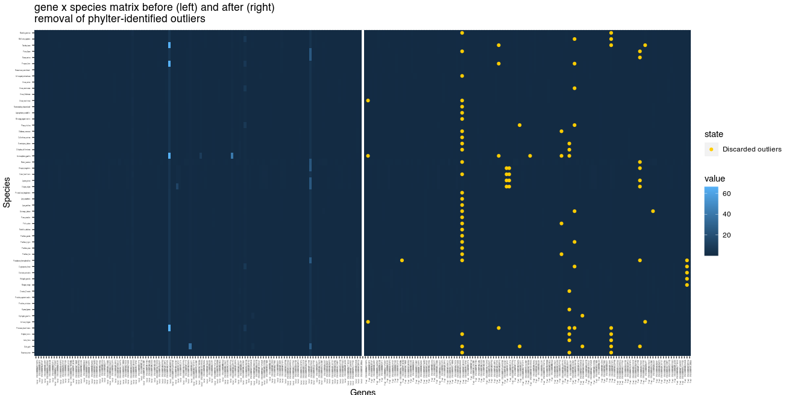

[](https://travis-ci.com/damiendevienne/phylter)
[](https://github.com/damiendevienne/phylter/actions)
# phylter, a tool for analyzing, visualizing and filtering phylogenomics datasets

**phylter** is a tool that allows detecting, removing and visualizing outliers in phylogenomics dataset by iteratively removing taxa in genes and optimizing a score of concordance between individual matrices.   
**phylter** relies on Distatis (Abdi et al, 2005), an extension of multidimensional scaling to 3 dimensions to compare multiple distance matrices at once.   
**phylter** takes as input either a collection of phylogenetic trees (that are converted to distance matrices by `phylter`), or a collection of pairwise distance matrices (obtained from multiple sequence alignements, for instance).  
**phylter** accepts data with missing values (missing taxa in some genes).  
**phylter** detects outliers with a method proposed by Hubert & Vandervieren (2008) for skewed data.  
**phylter** does not accept that the same taxa is present multiple times in the same gene. 

**phylter** is written in R language.


> **TABLE OF CONTENT**
> - [Installation](#installation)
> - [Quick start](#quick-start)
>    - [Options](#options)
> - [How phylter works](#how-phylter-works)
> - [Example](#example)
>    - [Running phylter](#running-phylter)
>    - [Exploring the results](#exploring-the-results)
>    - [Writing the output](#writing-the-output)
> - [References](#references)


## Installation
**phylter** is not yet on CRAN (deposit in process). To install the development version:    

1. Install the release version of `remotes` from CRAN:
```R
install.packages("remotes")
```

2. Install the development version of `phylter` from GitHub:
```R
remotes::install_github("damiendevienne/phylter")

```
3. Once installed, the package can be loaded:
```R
library("phylter")
```

> Note: phylter requires R version > 4.0, otherwise it cannot be installed. Also, R uses the GNU Scientific Library. On Ubuntu, this can be installed prior to the installation of the phylter package by typing `sudo apt install libgsl-dev` in a terminal. 


## Quick start

Here is a brief introduction to the use **phylter** on a collection of gene trees. To better understand how phylter really works, go to the section entitled [How phylter works](#how-phylter-works). To see its usage on a small biological dataset and view the different outputs of the tool, go to [Example](#example) section. For a full list of functions in the **phlyter** package you can download the full manual in pdf from [here](man/manual/phylter_0.9.5.pdf).

**1.** With the `read.tree` function from the `ape` package, read trees from external file and save as a list called `trees`.
```R
if (!requireNamespace("ape", quietly = TRUE))
   install.packages("ape")
trees <- ape::read.tree("treefile.tre")
```

**2.** (optional) Read or get gene names somewhere (same order as the trees) and save it as a vector called `names`.

**3.** Run `phylter` on your trees (see details below for possible options).
```R
results <- phylter(trees, gene.names = names)

```
>#### Options
>The phylter() function is called as follows by default:
>```R
>phylter(X, bvalue = 0, distance = "patristic", k = 3, k2 = k, Norm = "median", 
>  Norm.cutoff = 0.001, gene.names = NULL, test.island = TRUE, 
>  verbose = TRUE, stop.criteria = 1e-5, InitialOnly = FALSE, normalizeby = "row", parallel = TRUE)
>```
>
>Arguments are as follows:
>- `X`: A list of phylogenetic trees (phylo object) or a list of distance matrices. Trees can have different number of leaves and matrices can have different dimensions. If this is the case, missing values are imputed.
>- `bvalue`: If X is a list of trees, nodes with a support below `bvalue` will be collapsed prior to the outlier detection.
>- `distance`: If X is a list of trees, type of distance used to compute the pairwise matrices for each tree. Can be "patristic" (sum of branch lengths separating tips, the default) or "nodal" (number of nodes separating tips).
>- `k`: Strength of outlier detection. The higher this value the less outliers detected.
>- `k2`: Same as `k` for complete gene outlier detection. To preserve complete genes from being discarded, `k2` can be increased. By default, `k2 = k`.
>- `Norm`:  Should the matrices be normalized prior to the complete analysis and how. If "median", matrices are divided by their median; if "mean" they are divided by their mean; if "none", no normalization if performed. Normalizing ensures that fast-evolving (and slow-evolving) genes are not treated as outliers. Normalization by median is a better choice as it is less sensitive to outlier values.
>- `Norm.cutoff`: Value of the median (if `Norm = "median"`) or the mean (if `Norm = "mean"`) below which matrices are simply discarded from the analysis. This prevents dividing by 0, and allows getting rid of genes that contain mostly branches of length 0 and are therefore uninformative anyway. Discarded genes, if any, are listed in the output (`out$DiscardedGenes`).
>- `gene.names`: List of gene names used to rename elements in `X`. If NULL (the default), elements are named 1,2,...,length(X).
>- `test.island`: If TRUE (the default), only the highest value in an *island* of outliers is considered an outlier. This prevents non-outliers hitchhiked by outliers to be considered outliers themselves.
>- `verbose`: If TRUE (the default), messages are written during the filtering process to get information on what is happening.
>- `stop.criteria`: The optimization stops when the gain (quality of compromise) between round *n* and round *n*+1 is smaller than this value. Default to 1e-5.
>- `InitialOnly`: Logical. If TRUE, only the Initial state of the data is computed.
>- `normalizeby`: Should the gene x species matrix be normalized prior to outlier detection, and how.
>- `parallel`: Logical. Should the computations be parallelized when possible? Default to TRUE. Note that the number of threads cannot be set by the user when `parallel=TRUE`. It uses all available cores on the machine. 

**4.** Analyze the results

Many functions allow looking at the outliers detected and comparing before and after:

```R
summary(results) # Get a summary: nb of outliers, gain in concordance, etc.
plot(results, "genes") # show the number of species in each gene, and how many per gene are outliers
plot(results, "species") # show the number of genes where each species is found, and how many are outliers
plot2WR(results) # compare before and after genes x species matrices, highlighting missing data and outliers identified. (not efficient for large datasets)
plotDispersion(results) # plot the dispersion of data before and after outlier removal. One dot represents one gene x species association.
plotRV(results) # plot the genes x genes matrix showing pairwise correlation between genes.
plotopti(results) #plot optimization scores during optimization.
``` 

**5.** Save the results

Save the results of the analysis to an external file, for example to perform cleaning on raw alignments based on the results from `phylter`.
```R
write.phylter(results, file = "phylter.out")
```
## How **phylter** works

The phylteR method, in its entirety, is depicted in Figure 1. It starts with K distance matrices obtained from K orthologous genes families by either computing pairwise distances (sum of branch lengths) between species in each gene family tree, or directly from each gene family multiple sequence alignment (MSA). All the matrices are given the same dimensionality, using the mean values to impute missing data if any, and are then normalised by dividing each matrix by its median or its mean value (default is median). The normalisation by median prevents genes from fast- (resp. slow-) evolving orthologous gene families to be erroneously considered outliers, and is a better choice than a normalisation by the mean as it is less affected by outlier values. 




<p align="center">
   <b>Figure 1.</b> Principle of the PhylteR method for identifying outliers in phylogenomic datasets. The method relies on DISTATIS (grey block), an extension of multidimensional scaling to three dimensions. 
</p>


From the K matrices obtained, an incremental process starts, consisting in three main steps (1) comparison of the matrices with the DISTATIS method (Abdi et al. 2005; Abdi et al. 2012), (2) detection of gene outliers, and (3) evaluation of the impact of removing these gene outliers on the overall concordance between the matrices. Note that we refer to gene outliers as single genes in single species that do not follow the general trend, while outlier gene families refer to sets of orthologous genes for a group of species (also referred to as gene trees) that do not agree with the other gene families. 
These steps are repeated until no more gene outlier is detected, or until the removal of the identified gene outliers does not increase the concordance between the matrices more than a certain amount specified by the user. Before finishing the optimization, phylteR performs a last action consisting in checking whether some outlier gene families still exist despite the removal of outlier genes already performed. These outlier gene families correspond to  gene families whose lack of correlation with others is not due to a few outliers but are globally not following the trend. If outlier gene families are discarded there, the optimization restarts as it may have unblocked the detection of other gene outliers.


## Example

### Running phylter
A `carnivora` dataset (small subset from Allio et al. 2021) comprised of 125 gene families for 53 species (53x125=6625 genes in total) is included in the package. To load it and test `phylter` on it: 

```R
data(carnivora)
results <- phylter(carnivora) # for example
```

### Exploring the results

#### Summary

Typing `summary(results)` gives the following information: 

```console
Total number of outliers detected: 94
  Number of complete gene outliers : 0
  Number of complete species outliers : 0

Gain (concordance between matrices): 8.19% 
Loss (data filtering): 1.42% 

```
We see that with default parameters on the small carnivora dataset, 94 *gene outliers* were identified. No complete gene outliers (or *outlier gene families* were detected, meaning  that there are no gene families totally uncorrelated with the rest. There is also no complete specoes outliers, i.e. species whose position is very variable in the different gene trees (thgose are often called rogue taxa).

#### Detailed output
The variable called `results` is a large object (a list) of class `phylter`. 

It is divided into two subgroups (lists) defining the *Initial* (`results$Initial`) and the *Final* (`results$Final`) states for all the objects manipulated by **phylter** (see Figure 1). 

You can view the content of these lists and the description of each object it contains, like this:

```console
> results$Initial
Phylter Analysis - initial state
List of class phylterinitial

  Object      Dimension Content                                         
1 $mat.data   125       List of original distance matrices, one per gene
2 $WR         53 x 125  Species x Genes reference matrix                
3 $RV         125 x 125 Genes x Genes RV correlation coefficients matrix
4 $weights    125       Weight of each gene in the compromise           
5 $compromise 53 x 53   Species x Species compromise matrix             
6 $F          53 x 6    Distatis coordinates of compromise              
7 $matrices   125       Distatis coordinates of gene matrices (list)    
8 $PartialF   125       Species x Species gene matrices (list)          


> results$Final
Phylter Analysis - final state
List of class phylterfinal

   Object            Dimension Content                                           
1  $WR               53 x 125  Species x Genes reference matrix                  
2  $RV               125 x 125 Genes x Genes RV correlation coefficients matrix  
3  $weights          125       Weight of each gene in the compromise             
4  $compromise       53 x 53   Species x Species compromise matrix               
5  $F                53 x 8    Distatis coordinates of compromise                
6  $PartialF         125       Distatis coordinates of gene matrices (list)      
7  $species.order    53        Name and order of species                         
8  $AllOptiScores    11        Evolution of quality of compromise (11 steps)     
9  $CELLSREMOVED     94 x 2    Index of cells removed (may contain imputed cells)
10 $Outliers         94 x 2    Outliers detected (one row = one outlier cell)    
11 $CompleteOutliers 2         Complete outliers (Gene and Species, if any)      
12 $matrices         125       Species x Species gene matrices (list)            
```


#### Visualize the distribution of outliers

Typing `plot(results, "genes")` allows exploring the number of outliers identified by **phylter** for each gene. Here is how it looks for the example dataset: 



We observe that a few gene families have a lot of outliers, while others have none. One gene family has even almost half of its gene sequences discarded. 


Typing `plot(results, "species")` allows exploring the number of genes for which each species was identified as outlier. 


Here we see that no no species is particularly problematic. Almost each species is an outlier in at least one gene family.

#### Visualize the 2-way reference matrix from which outliers are detected

The 2WR matrix (see Figure 1) is the species x genes matrix computed at each loop of the **phylter** iterative process, from which outliers are detected. A large value in one cell of this matrix (ligh blue cells in the following figure) refers to one species in one gene tree whose position is not in accordance with its position in the other gene trees. The two 2WR matrices below represent the 2WR matrix before and after using **phylter**. In yellow we see the outliers that **phylter** identified and discarded during the process. We observe that the cells with high values on the left matrix were those identified as outliers by **phylter**, which is expected. The fact that some cells on the left matrix do not seem so different from theothers but are still identified as outlirs by phylter is because the process is iterative and these less-obvious outliers were maybe more obvious after having discareded a first set of outliers.



### Writing the output

---
## References

- Abdi, H., O’Toole, A.J., Valentin, D. & Edelman, B. (2005). *DISTATIS: The analysis of multiple distance matrices.* Proceedings of the IEEE Computer Society: International Conference on Computer Vision and Pattern Recognition (San Diego, CA, USA). doi: 10.1109/CVPR.2005.445. https://www.utdallas.edu/~herve/abdi-distatis2005.pdf

- Allio, R., Tilak, M. K., Scornavacca, C., Avenant, N. L., Kitchener, A. C., Corre, E., ... & Delsuc, F. (2021). High-quality carnivoran genomes from roadkill samples enable comparative species delineation in aardwolf and bat-eared fox. Elife, 10, e63167. https://doi.org/10.7554/eLife.63167

- Hubert, M. and Vandervieren, E. (2008). *An adjusted boxplot for skewed distributions.* Computational Statistics and Data Analysis. https://doi.org/10.1016/j.csda.2007.11.008

- de Vienne D.M., Ollier S. et Aguileta G. (2012). *Phylo-MCOA: A Fast and Efficient Method to Detect Outlier Genes and Species in Phylogenomics Using Multiple Co-inertia Analysis.* Molecular Biology and Evolution. https://doi.org/10.1093/molbev/msr317 (This is the ancestor of phylter). 


---
For comments, suggestions and bug reports, please open an [issue](https://github.com/damiendevienne/phylter/issues) on this GitHub repository.

