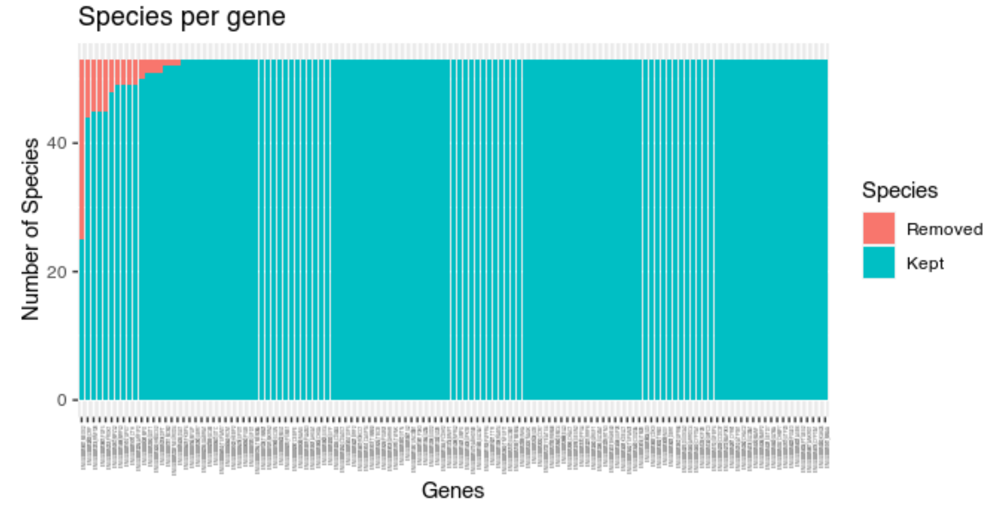

```{r setup, echo=FALSE, message=FALSE, warning=FALSE}
require(phylter)
require(ape)
```

# Installation

**`phylter`** is not yet on CRAN (deposit in process). To install the development version:    

1. Install the release version of `remotes` from CRAN:
```{r, eval = FALSE}
install.packages("remotes")
```

2. Install the development version of `phylter` from GitHub:
```{r, eval = FALSE}
remotes::install_github("damiendevienne/phylter")
```

3. Once installed, the package can be loaded:
```{r, eval = FALSE}
library("phylter")
```

Note that `phylter` requires R version > 4.0, otherwise it cannot be installed. 
Also, R uses the GNU Scientific Library. 
On Ubuntu, this can be installed prior to the installation of the `phylter` package by typing `sudo apt install libgsl-dev` in a terminal. 


# Quick start

Here is a brief introduction to the use `phylter` on a collection of gene trees. 
To better understand how `phylter` really works, go to the section entitled [How phylter works](#how-phylter-works). 
To see its usage on a small biological dataset and view the different outputs of the tool, go to [Example](#example) section. 
A full list of functions in the `phylter` package is [here](https://damiendevienne.github.io/phylter/reference/index.html).

**1.** With the `read.tree` function from the `ape` package, read trees from external file and save as a list called `trees`.
```{r, eval = FALSE}
if (!requireNamespace("ape", quietly = TRUE))
   install.packages("ape")
trees <- ape::read.tree("treefile.tre")
```

**2.** (optional) Read or get gene names somewhere (same order as the trees) and save it as a vector called `names`.

**3.** Run `phylter` on your trees (see details below for possible options).
```{r, eval = FALSE}
results <- phylter(trees, gene.names = names)
```

The `phylter()` function is called as follows by default:

```{r, eval = FALSE}
phylter(X, bvalue = 0, distance = "patristic", k = 3, k2 = k, Norm = "median", 
  Norm.cutoff = 0.001, gene.names = NULL, test.island = TRUE, 
  verbose = TRUE, stop.criteria = 1e-5, InitialOnly = FALSE, 
  normalizeby = "row", parallel = TRUE)
```

Arguments are as follows:

- `X`: A list of phylogenetic trees (phylo object) or a list of distance matrices. Trees can have different number of leaves and matrices can have different dimensions. If this is the case, missing values are imputed.
- `bvalue`: If `X` is a list of trees, nodes with a support below `bvalue` will be collapsed prior to the outlier detection.
- `distance`: If `X` is a list of trees, type of distance used to compute the pairwise matrices for each tree. Can be "patristic" (sum of branch lengths separating tips, the default) or "nodal" (number of nodes separating tips).
- `k`: Strength of outlier detection. The higher this value the less outliers detected.
- `k2`: Same as `k` for complete gene outlier detection. To preserve complete genes from being discarded, `k2` can be increased. By default, `k2 = k`.
- `Norm`:  Should the matrices be normalized prior to the complete analysis and how. If "median", matrices are divided by their median; if "mean", they are divided by their mean; if "none", no normalization if performed. Normalizing ensures that fast-evolving (and slow-evolving) genes are not treated as outliers. Normalization by median is a better choice as it is less sensitive to outlier values.
- `Norm.cutoff`: Value of the median (if `Norm = "median"`) or the mean (if `Norm = "mean"`) below which matrices are simply discarded from the analysis. This prevents dividing by 0, and allows getting rid of genes that contain mostly branches of length 0 and are therefore uninformative anyway. Discarded genes, if any, are listed in the output (`out$DiscardedGenes`).
- `gene.names`: List of gene names used to rename elements in `X`. If NULL (the default), elements are named 1,2,...,length(X).
- `test.island`: If `TRUE` (the default), only the highest value in an *island* of outliers is considered an outlier. This prevents non-outliers hitchhiked by outliers to be considered outliers themselves.
- `verbose`: If `TRUE` (the default), messages are written during the filtering process to get information on what is happening.
- `stop.criteria`: The optimization stops when the gain (quality of compromise) between round *n* and round *n*+1 is smaller than this value. Default to 1e-5.
- `InitialOnly`: Logical. If `TRUE`, only the Initial state of the data is computed.
- `normalizeby`: Should the gene $\times$ species matrix be normalized prior to outlier detection, and how.
- `parallel`: Logical. Should the computations be parallelized when possible? Default to `TRUE`. Note that the number of threads cannot be set by the user when `parallel = TRUE`. It uses all available cores on the machine. 

**4.** Analyze the results.

You can get a list of outliers by simply typing:

```{r, eval = FALSE}
results$Final$Outliers
```

In addition, many functions allow looking at the outliers detected and comparing before and after *phy*ltering. 
All these functions are detailed in the [Example](#example) section. 

```{r, eval = FALSE}
# Get a summary: nb of outliers, gain in concordance, etc.
summary(results)

# Show the number of species in each gene, and how many per gene are outliers
plot(results, "genes") 

# Show the number of genes where each species is found, and how many are outliers
plot(results, "species") 

# Compare before and after genes $\times$ species matrices, highlighting missing data and outliers 
# identified (not efficient for large datasets)
plot2WR(results) 

# Plot the dispersion of data before and after outlier removal. One dot represents one 
# gene $\times$ species association
plotDispersion(results) 

# Plot the genes $\times$ genes matrix showing pairwise correlation between genes
plotRV(results) 

# Plot optimization scores during optimization
plotopti(results) 
``` 

**5.** Save the results of the analysis to an external file, for example to perform cleaning on raw alignments based on the results from `phylter`.
  
```{r, eval = FALSE}
write.phylter(results, file = "phylter.out")
```

# How `phylter` works

The `phylter` method, in its entirety, is depicted in [Figure 1](#fig1-phyler). 
It starts with K distance matrices obtained from K orthologous genes families by either computing pairwise distances (sum of branch lengths) between species in each gene family tree, or directly from each gene family multiple sequence alignment (MSA). 
All the matrices are given the same dimensionality, using the mean values to impute missing data if any, and are then normalised by dividing each matrix by its median or its mean value (default is median). 
The normalisation by median prevents genes from fast- (resp. slow-) evolving orthologous gene families to be erroneously considered outliers, and is a better choice than a normalisation by the mean as it is less affected by outlier values. 

<br>
<div style="text-align:center">
<a name="fig1-phyler"></a>
<span style="color:blue"><b>Figure 1.</b> Principle of the phylter method for identifying outliers in phylogenomic datasets. The method relies on DISTATIS (grey block), an extension of multidimensional scaling to three dimensions.</span>

</div>
<br>


From the K matrices obtained, an incremental process starts, consisting in three main steps 
(1) comparison of the matrices with the DISTATIS method (Abdi et al. 2005; Abdi et al. 2012), 
(2) detection of gene outliers, and 
(3) evaluation of the impact of removing these gene outliers on the overall concordance between the matrices. 
Note that we refer to gene outliers as single genes in single species that do not follow the general trend, while outlier gene families refer to sets of orthologous genes for a group of species (also referred to as gene trees) that do not agree with the other gene families.
These steps are repeated until no more gene outlier is detected, or until the removal of the identified gene outliers does not increase the concordance between the matrices more than a certain amount specified by the user. 
Before finishing the optimization, `phylter` performs a last action consisting in checking whether some outlier gene families still exist despite the removal of outlier genes already performed. 
These outlier gene families correspond to  gene families whose lack of correlation with others is not due to a few outliers but are globally not following the trend. 
If outlier gene families are discarded there, the optimization restarts as it may have unblocked the detection of other gene outliers.


# Example

## Running phylter
A `carnivora` dataset (small subset from Allio et al. 2021) comprised of 125 gene families for 53 species (53 $\times$ 125 = 6625 genes in total) is included in the package. To load it and test `phylter` on it: 

```{r, results='hide'}
data(carnivora, package = "phylter")
results <- phylter(carnivora) # for example
```

## Exploring the results

### Summary
Typing `summary(results)` gives the following information: 

```{r}
summary(results)
```
We see that with default parameters on the small `carnivora` dataset, 94 *gene outliers* were identified. 
No complete gene outliers (or *outlier gene families*) were detected, meaning that there are no gene families totally uncorrelated with the rest. 
There is also no complete species outliers, i.e. species whose position is very variable in the different gene trees (those are often called rogue taxa).


### Detailed output
The variable called `results` is a large object (a list) of class `phylter`. 

It is divided into two subgroups (lists) defining the *Initial* (`results$Initial`) and the *Final* (`results$Final`) states for all the objects manipulated by `phylter` (see [Figure 1](#fig1-phyler)). 

You can view the content of these lists and the description of each object it contains, like this:

```{r}
results$Initial
results$Final
```

As an example, you can access to the initial distance matrices by typing `results$Initial$mat.data` or to the weights associated to each gene by typing `results$Initial$weights` (see [Figure 1](#fig1-phyler)). 

Maybe more interesting is to **get access to the list of outliers identified by `phylter`**. 
As we can see above, this is done by typing `results$Final$Outliers`. 
This prints a matrix with two columns (extract below). 
Each row is an outlier. 
The first column represents the gene family were the outlier was found and the second column is the species identified as outlier in this gene family.  

```{r}
results$Final$Outliers
```

All the informations present in these different objects returned by `phylter` can be difficult to fully understand and to easily use for other steps of bioinformatics pipelines. 
For this reason, multiple functions are proposed to either visualize the results or write the results in formatted output files that can be used elsewhere. 
These are detailed in the next sections. 

### Visualize the correlation between gene families (the RV matrix) before and after `phylter`

As shown in [Figure 1](#fig1-phyler), at each step of the iterative process, `phylter` computes a matrix (called RV) containing the correlation coefficients between individual gene matrices. 
This RV matrix thus gives information on the overall congruence between each gene family and the others. 
With `phylter`, we can visualize this matrix before (`plotRV(results, what = "Initial")`) and after (`plotRV(results, what = "Final")`) the detection and removal of the outliers. 
The two matrices are displayed below. 
It clearly appears that the removal of outliers identified by `phylter` increased the overall concordance between the gene matrices by removing the few genes that were causing this loss of concordance. 

{width=100%}

### Visualize the 2-way reference matrix from which outliers are detected

The 2WR matrix (see [Figure 1](#fig1-phyler)) is the species $\times$ genes matrix computed at each loop of the `phylter` iterative process, from which outliers are detected. 
A large value in one cell of this matrix (light blue cells in the following figure) refers to one species in one gene tree whose position is not in accordance with its position in the other gene trees. 
The two 2WR matrices below represent the 2WR matrix before (left) and after (right) using `phylter`. 
In yellow, we see the outliers that `phylter` identified and discarded during the process. 
We observe that the cells with high values on the left matrix were those identified as outliers by `phylter`, which is expected. 
The fact that some cells on the left matrix do not seem so different from the others but are still identified as outlirs by `phylter` is because the process is iterative and these less-obvious outliers were maybe more obvious after having discarded a first set of outliers.
This figure is obtained by typing `plot2WR(results)`.

{width=100%}


### Visualize the distribution of outliers

Typing `plot(results, "genes")` allows exploring the number of outliers identified by `phylter` for each gene. 
Here is how it looks for the example dataset: 

{width=100%}

We observe that a few gene families have a lot of outliers, while others have none. 
One gene family has even almost half of its leaves (species) discarded. 

Typing `plot(results, "species")` allows exploring the number of genes for which each species was identified as outlier. 

{width=100%}

Here we see that no species is particularly problematic. 
Almost each species is an outlier in at least one gene family.


### Visualize the effect of `phylter` in terms of data dispersion

Removing outliers in a dataset can be seen as a way of decreasing the *dispersion* of data if they were to be represented on a 2D map. 
With `phylter`, this can be easily viewed. 
For each species, we can compute the distance, in the compromise space (see [Figure 1](#fig1-phyler)), between its position in a given gene tree and its reference position. 
This can be done along the *x* and the *y* axes for example, and be compared before and after the use of `phylter`. 
This is what is represented hereafter. 
We observe a sharp decrease of the dispersal of the points after having employed `phylter` on the dataset. 

This figure is obtained by simply typing `plotDispersion(results)`.

{width=100%}


### Visualize the evolution of the quality score of the compromise matrix

At each step of the iterative process of `phylter` ([Figure 1](#fig1-phyler)), a *quality* score is computed describing how much individual gene matrices are correlated. 
This score increases when outliers are removed, and the gain in quality achieved by removing the outliers at each step is one of the criteria for stopping the overall iterative process. 
The evolution of this score can be visualized with `phylter` by typing `plotopti(results)`. 
The output is given below. 

{width=100%}

We see that on this dataset, `phylter` performed 11 steps before stopping. 


## Writing the output

`phylter` can write two types of output files:

- a **pdf report**, containing a summary of the results along with all the figures presented above. To get the pdf report, simply type `write.phylter(results, pdfreport = TRUE)`. This will generate a file called `report.pdf`. An example of such a file can be can be seen [here](report.pdf).
- a **text report** with a summary of the `phylter` run performed and a formatted list of outliers. To get a text report, easy to parse and to use with other scripts in order (for instance) to clean the multiple sequence alignement or to prune outliers in gene trees, you just have to type `write.phylter(results, file = "output.txt")`. This will generate a file called `output.txt` that will ressemble [this one](output.txt).

If no file name is given, the report is written to the console. 
Such an example is given below.

```{r, eval = FALSE}
write.phylter(results)
```


# References

- Abdi, H., O’Toole, A.J., Valentin, D. & Edelman, B. (2005). 
*DISTATIS: The Analysis of Multiple Distance Matrices*. 
2005 IEEE Computer Society Conference on Computer Vision and Pattern Recognition (CVPR'05) - Workshops. 
doi: 10.1109/CVPR.2005.445. https://www.utdallas.edu/~herve/abdi-distatis2005.pdf

- Allio, R., Tilak, M.K., Scornavacca, C., Avenant, N.L., Kitchener, A.C., Corre, E., Nabholz, B. & Delsuc, F. (2021). 
*High-quality carnivoran genomes from roadkill samples enable comparative species delineation in aardwolf and bat-eared fox*. 
eLife, 10, e63167. 
doi: 10.7554/eLife.63167.

- Hubert, M. and Vandervieren, E. (2008). 
*An adjusted boxplot for skewed distributions*. 
Computational Statistics and Data Analysis. 
doi: 10.1016/j.csda.2007.11.008.

- de Vienne D.M., Ollier S. et Aguileta G. (2012). 
*Phylo-MCOA: A Fast and Efficient Method to Detect Outlier Genes and Species in Phylogenomics Using Multiple Co-inertia Analysis*. 
Molecular Biology and Evolution. 
doi: 10.1093/molbev/msr317 (This is the ancestor of phylter). 


---
For comments, suggestions and bug reports, please open an [issue](https://github.com/damiendevienne/phylter/issues) on this GitHub repository.

